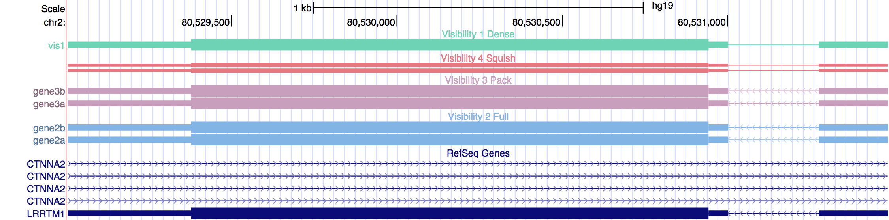

# Custom annotation tracks in BED format

```
browser position chr2:80529003-80531487
browser hide all
browser pack refGene

# Visibility 0 = hide
# Annotations not shown (hide means hide, yes)
track name=vis0 description="Visibility 0 Hide" visibility=0 color=100,100,100
chr2 80529002 80531487 gene0 1 - 80529375 80530944 0 2 2001,211 0,2274

# Visibility 1 = dense
# All annotations shown in a single track
# Track name: the one set in name=xxx (vis1 in this example)
# Introns do NOT show information for +/- strand
track name=vis1 description="Visibility 1 Dense" visibility=1 color=110,210,180
chr2 80529002 80531487 gene1a 1 - 80529375 80530944 0 2 2001,211 0,2274
chr2 80529002 80531487 gene1b 1 - 80529375 80530944 0 2 2001,211 0,2274

# Visibility 4 = squish
# Annotations shown in various thin tracks
# Track name: none
# Introns do NOT show information for +/- strand
track name=vis4 description="Visibility 4 Squish" visibility=4 color=230,120,130
chr2 80529002 80531487 gene4a 1 - 80529375 80530944 0 2 2001,211 0,2274
chr2 80529002 80531487 gene4b 1 - 80529375 80530944 0 2 2001,211 0,2274

# Visibility 3 = pack
# Annotations shown in various normal size tracks
# Track name: the one set in details for each line (gene3a & gene3b in this example)
# Introns do show information for +/- strand
track name=vis3 description="Visibility 3 Pack" visibility=3 color=200,160,190
chr2 80529002 80531487 gene3a 1 - 80529375 80530944 0 2 2001,211 0,2274
chr2 80529002 80531487 gene3b 1 - 80529375 80530944 0 2 2001,211 0,2274

# Visibility 2 = full
# Annotations shown in various normal size tracks
# Track name: the one set in details for each line (gene2a & gene2b in this example)
# Introns do show information for +/- strand
track name=vis2 description="Visibility 2 Full" visibility=2 color=130,180,230
chr2 80529002 80531487 gene2a 1 - 80529375 80530944 0 2 2001,211 0,2274
chr2 80529002 80531487 gene2b 1 - 80529375 80530944 0 2 2001,211 0,2274
```

And this is how these custom tracks look in the [UCSC Genome Browser](http://genome.cse.ucsc.edu/cgi-bin/hgGateway).


