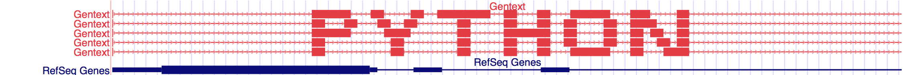

# Python script to create ASCII art with BED custom tracks

I've just published a new repo with a really silly Python 3.6 script to convert a text into custom annotation tracks using BED format:

🔗 https://github.com/almata/Gentext

This is how the script works:

```bash
$ ./gentext.py -txt="PYTHON"

browser position chr2: 80527503-80536454
browser hide all
browser pack refGene
track name=Gentext description=Gentext visibility=2 color=227,60,69
chr2 80529003 80534954 Gentext 0 + 0 0 0  10 1,100,100,100,100,100,300,100,200,1 0,1500,2100,2600,2950,3200,3450,3900,4150,5950
chr2 80529003 80534954 Gentext 0 + 0 0 0  12 1,100,100,100,100,100,100,100,100,100,100,1 0,1500,2100,2600,2950,3200,3400,3700,3900,4100,4250,5950
chr2 80529003 80534954 Gentext 0 + 0 0 0  11 1,300,200,100,350,100,100,100,100,100,1 0,1500,2050,2600,2950,3400,3700,3900,4050,4250,5950
chr2 80529003 80534954 Gentext 0 + 0 0 0  13 1,100,100,100,100,100,100,100,100,100,200,100,1 0,1500,1750,2000,2200,2600,2950,3200,3400,3700,3900,4250,5950
chr2 80529003 80534954 Gentext 0 + 0 0 0  11 1,300,100,100,400,100,100,300,150,100,1 0,1500,1950,2250,2450,2950,3200,3450,3900,4250,5950
```

And adding these custom tracks in the [UCSC Genome Browser](http://genome.cse.ucsc.edu/cgi-bin/hgGateway):


